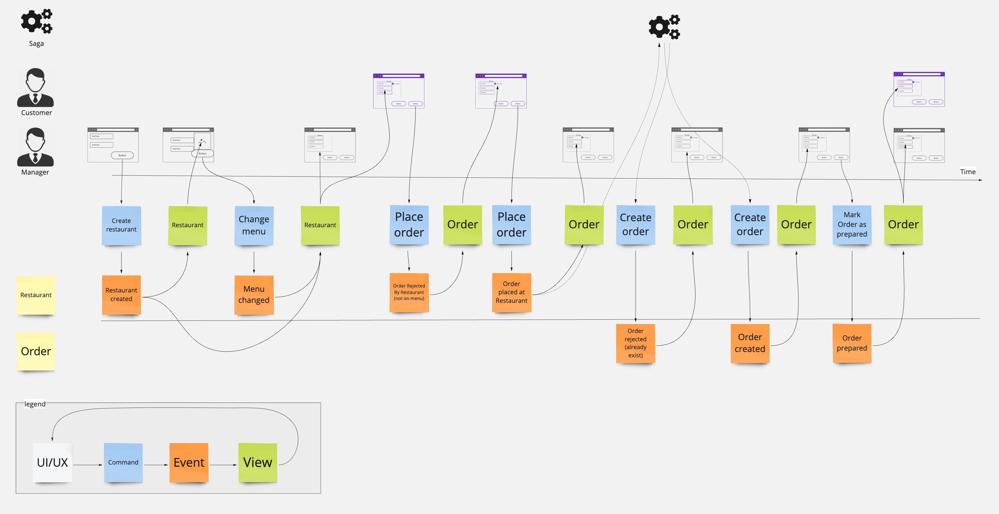

# `fmodel-rust-postgres`

Effortlessly transform your domain models into powerful PostgreSQL extensions using our GitHub repository template.
With pre-implemented infrastructure and application layers in the `framework` module, you can focus entirely on your core domain logic while running your models directly within your PostgreSQL database for seamless integration and enhanced performance.

The template includes a demo domain model of a `restaurant/order management system`, showcasing practical implementation and providing a solid foundation for your own projects.



>Actually, the domain model is copied from the traditional application [fmodel-rust-demo](https://github.com/fraktalio/fmodel-rust-demo), demonstrating how to run your unique and single domain model directly within your PostgreSQL database/`as extension`; or connect the application to the database/`traditionally`.

## Event Sourcing

With event sourcing, we delve deeper by capturing every decision or alteration as an event.
Each new transfer or modification to the state is meticulously documented, providing a comprehensive audit trail
of all activities.
This affords you a 100% accurate historical record of your domain, enabling you to effortlessly traverse back
in time and review the state at any given moment.

**History is always on!**

## Technology
This project is using:

- [`rust` programming language](https://www.rust-lang.org/) to build a high-performance, reliable, and efficient system.
- [fmodel-rust library](https://github.com/fraktalio/fmodel-rust) to implement tactical Domain-Driven Design patterns, optimised for Event Sourcing.
- [pgrx](https://github.com/pgcentralfoundation/pgrx) to simplify the creation of custom Postgres extensions and bring `logic` closer to your data(base).

## Requirements
- [Rust](https://www.rust-lang.org/tools/install)
- [PGRX subcommand](https://github.com/pgcentralfoundation/pgrx?tab=readme-ov-file#getting-started): `cargo install --locked cargo-pgrx`
- Run `cargo pgrx init` once, to properly configure the pgrx development environment. It downloads the latest releases of supported Postgres versions, configures them for debugging, compiles them with assertions, and installs them to `"${PGRX_HOME}"`. These include all contrib extensions and tools included with Postgres. Other cargo pgrx commands such as `run` and `test` will manage and use these installations on your behalf.

> No manual Postgres database installation is required.

## Test it / Run it
Run tests:

```shell
cargo pgrx test
```

Compile/install extension to a pgrx-managed Postgres instance and start psql:
```shell
cargo pgrx run
```

Confused? Run `cargo pgrx help`

## The structure of the project

The project is structured as follows:
- [lib.rs](src/lib.rs) file contains the entry point of the package/crate.
- `framework` module contains the generalized and parametrized implementation of infrastructure and application layers.
- `domain` module contains the domain model. It is the core and pure domain logic of the application!!!
- `application` module contains the application layer. It is the orchestration of the domain model and the infrastructure layer (empty, as it is implemented in the `framework` module).
- `infrastructure` module contains the infrastructure layer / fetching and storing data (empty, as it is implemented in the `framework` module).

The framework module offers a generic implementation of the infrastructure and application layers, which can be reused across multiple domain models.
Your focus should be on the `domain` module, where you can implement your unique domain model. We have provided a demo domain model of a `restaurant/order management system` to get you started.

## Check the tests
The project contains a set of tests that demonstrate how to use the domain model and the framework.
You can find them in the root: [lib.rs](src/lib.rs).

You will find a command handler function only, which can handle all the commands of the system! Simple!

## References and further reading
- [pgrx](https://github.com/pgcentralfoundation/pgrx)
- [fmodel-rust](https://github.com/fraktalio/fmodel-rust)

---
Created with :heart: by [Fraktalio](https://fraktalio.com/)
